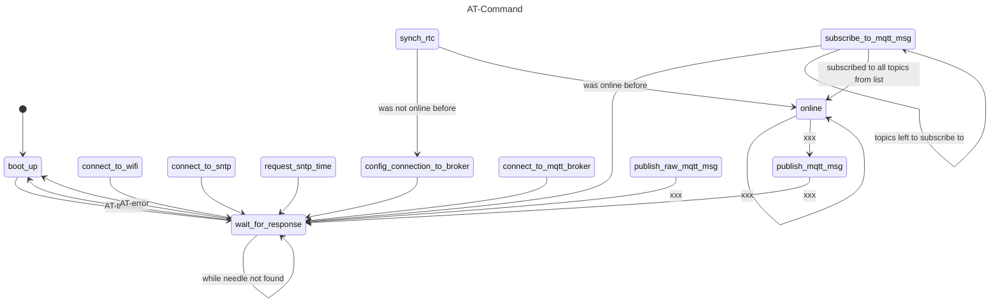

# ESP32 as Wifi Coprocessor with AT-Command-Firmware
The ESP32 is a very popular microcontroller with integrated Wifi and Bluetooth hardware.
The ESP32 is also available as ready to use and pre CE certificated modules with very attractive budget.
This approach makes it so successfully, that it has become a serious competitor to the well know Arduino platform.  

Many people use a random ESP32 module (e.g. [D1 Mini](https://www.az-delivery.de/products/esp32-d1-mini)) and the Arduino IDE or PlattformIO IDE to create wireless projects.
But there is another way to bring your application online.
The so called ESP32-AT-Command [firmware](https://docs.espressif.com/projects/esp-at/en/latest/esp32/AT_Command_Set/index.html) is a standalone piece of software running on the ESP32 tuning the ESP32 into a wireless-coprocessor.
With only two uart pins it is possible to bring any microcontroller to network.
The actual application code runs on your preferred MCU. The key issue is that, the AT-Command handler and the application code **must** be concurrent (deutsch: nebenlaeufig). The application code should not be halted at any time because the AT-Command-handler is waiting for some sort of response due to weak internet connection.  

The AT-commands are also used in most of the cellular modules. This little example could be the blueprint for other IoT project.
The hardware I used for this Demo is a STM32 Nucleo-F446RE Dev Board attached to a carrier board with a ESP32 soldered on it.
  

I also used a basic node-red flow to have some 'backend' buttons and diagrams. You could see it as some sort of server ore cloud service and the board simulates a IoT-Node.  
  
  
  

The Nucleo runs seven noRTOS tasks. One takes care of the connectivity state machine and one sends periodic telemetry data to the server. The rest is demo stuff like flashing a snake LED string or print `hello world` to the terminal.  
  
  

Here is a state diagram of what the AT-Command-Handler is doing.  
