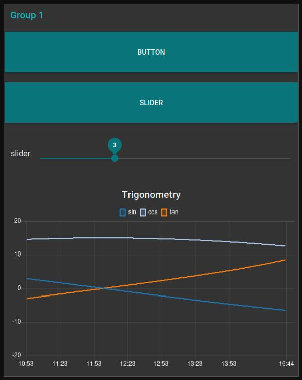

# ESP32 as Wifi Coprocessor with AT-Command-Firmware
The ESP32 is a very popular microcontroller with integrated Wifi and Bluetooth Hardware.
The ESP32 is also available as ready to use and pre CE certificated Modules with very attractive budget.  
This approach is so successfully, that it has become a serious competitor to the well know Arduino platform.  

Many people use one ESP32 module and the Arduino IDE or PlattformIO IDE to create wireless projects.  
But there is another way to bring your application online.  
The so called ESP32-AT-Command Firmware is a standalone piece of software running on the ESP32.  
With only two uart pins it is possible to bring any microcontroller to network.  

The AT-commands are also used in most of the cellular modules. This little example could be the blueprint for other IoT project.  

  
  
  
  
